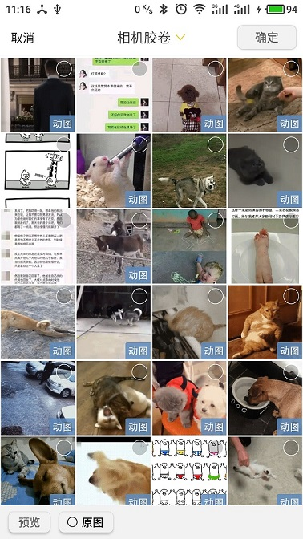
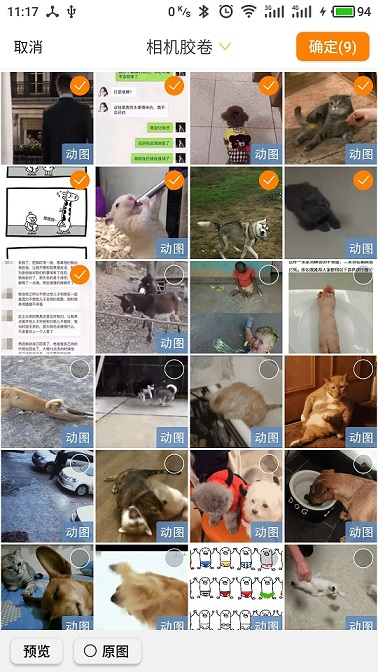
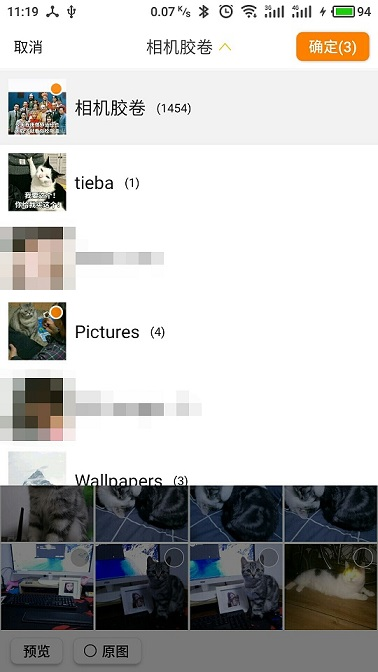
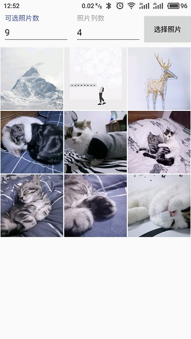

## PhotoSelector 照片选择器
仿新浪微博照片选择器
## 效果图

##如何使用
1.Gradle添加依赖:

(1)在Project的build.gradle中添加:

	allprojects {
		repositories {
			...
			maven { url 'https://jitpack.io' }
		}
	}

(2)Module的build.gradle中添加:

	dependencies {
		...
	    compile 'com.github.NaclFire:PhotoSelector:1.1'
	}

2.在AndroidManifest.xml中添加:

	<application
		...
        <activity
            android:name="com.fire.photoselector.activity.PhotoSelectorActivity"
            android:configChanges="orientation|screenSize"
            android:screenOrientation="portrait" />
        <activity
            android:name="com.fire.photoselector.activity.PhotoViewActivity"
            android:configChanges="orientation|screenSize"
            android:screenOrientation="portrait" />
	</application>

3.所需权限:

	<uses-permission android:name="android.permission.READ_EXTERNAL_STORAGE" />

4.Java代码:

	在需要开启照片选择器的地方调用:
	private void selectPhotos(int sum, int columnCount) {
        // 最大可选照片数
        PhotoSelectorSetting.MAX_PHOTO_SUM = sum;
        // 照片列表列数
        PhotoSelectorSetting.COLUMN_COUNT = columnCount;
        Intent intent = new Intent(MainActivity.this, PhotoSelectorActivity.class);
        intent.putExtra(PhotoSelectorSetting.LAST_MODIFIED_LIST, result);
        startActivityForResult(intent, REQUEST_SELECT_PHOTO);
    }

	在onActivityResult中接收返回集合:
	@Override
    protected void onActivityResult(int requestCode, int resultCode, Intent data) {
        super.onActivityResult(requestCode, resultCode, data);
        switch (requestCode) {
            case REQUEST_SELECT_PHOTO:
                if (resultCode == RESULT_OK) {
                    // result为照片绝对路径集合,isSelectedFullImage标识是否选择原图
                    result = data.getStringArrayListExtra(PhotoSelectorSetting.LAST_MODIFIED_LIST);
                    boolean isSelectedFullImage = data.getBooleanExtra(PhotoSelectorSetting.SELECTED_FULL_IMAGE, false);
                    // TODO: 获取照片后的操作
                }
                break;
        }
    }
	
